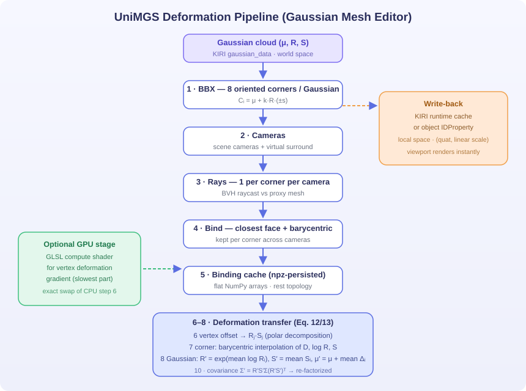

# Gaussian Mesh Editor

A Blender add-on for **proxy-mesh-based editing of 3D Gaussian Splatting (3DGS) scenes**.

Gaussian Mesh Editor is designed as an independent companion tool for [KIRI 3DGS Render](https://github.com/xiaolongyuan/KIRI3DGS). It communicates with KIRI through Blender-side data and does **not modify KIRI's source code**.

The project currently focuses on reproducing and engineering the **proxy-based Gaussian deformation pipeline described in UniMGS**, while providing a practical Blender workflow for alignment, proxy fitting, Gaussian binding, and deformation.

> **UniMGS: Unifying Mesh and 3D Gaussian Splatting with Single-Pass Rasterization and Proxy-Based Deformation**  
> Zeyu Xiao, Mingyang Sun, Yimin Cong, Lintao Wang, Dongliang Kou, Zhenyi Wu, Dingkang Yang, Peng Zhai, Zeyu Wang, Lihua Zhang  
> AAAI 2026 · [arXiv:2601.19233](https://arxiv.org/html/2601.19233)



## Project Status

**Current stage: practical UniMGS deformation reproduction + Blender editing prototype.**

The implementation covers the proxy-based deformation part of the UniMGS pipeline. It does **not** reproduce the paper's complete single-pass mesh + 3DGS rasterizer.

Some parts of the current implementation are engineering approximations rather than exact reproductions of the original research code. In particular:

- the default binding cameras are Blender scene cameras plus virtual surround cameras;
- the local vertex deformation-gradient calculation is an ACAP-inspired approximation rather than a full global ACAP implementation;
- Gaussian BBX size is controlled by an implementation parameter and is not claimed to be specified by the paper.

These distinctions are documented so that the project can be used both as a practical Blender tool and as a reproducible research baseline.

## Features

- **Proxy-mesh workflow** — designate a scene mesh as a proxy, roughly align it to the Gaussian cloud, then refine it using Blender's native `G / R / S` tools.
- **Subdivide & Fit** — subdivide the proxy and fit its vertices to the Gaussian surface using `NEAREST` or tangent-plane (`PLANE`) projection with optional Laplacian smoothing.
- **Gaussian-centric binding** — construct Gaussian BBX corners and associate them with proxy-mesh faces through camera-ray BVH intersection.
- **Proxy-based deformation** — transfer proxy-mesh deformation to Gaussian position, rotation, and scale using the UniMGS-style Eq. 12 / Eq. 13 formulation.
- **Covariance propagation** — propagate Gaussian covariance through the estimated deformation and convert it back to KIRI's quaternion + linear-scale representation.
- **Live Auto-Follow** — optionally update bound Gaussians while editing the proxy mesh.
- **Optional GPU acceleration** — accelerate the per-vertex deformation-gradient stage with a GLSL compute shader, with CPU fallback.
- **KIRI interoperability** — communicate with KIRI through Blender data structures without modifying the KIRI add-on.
- **Pure-NumPy core** — the `unimags` package is designed to remain independent of `bpy` where possible, making numerical components easier to test.

## Requirements

| Component | Version |
| --- | --- |
| Blender | ≥ 5.1 (tested on Blender 5.2 LTS) |
| Python | Blender's bundled Python |
| NumPy | Blender's bundled NumPy |
| KIRI 3DGS Render | Optional; required for the KIRI-based Gaussian import/render workflow |

KIRI is not required for the numerical `unimags` components themselves.

## Installation

### Blender Extension

1. Download a release package containing the `gaussian_mesh_editor/` add-on.
2. In Blender, open **Edit → Preferences → Get Extensions → Install from Disk...**.
3. Select the extension ZIP and enable **Gaussian Mesh Editor**.

### Legacy Add-on Installation

1. Unzip the `gaussian_mesh_editor/` directory into Blender's add-ons directory.
2. Open **Edit → Preferences → Add-ons**.
3. Enable **Gaussian Mesh Editor**.

See [docs/installation.md](docs/installation.md) for more details.

## Quick Start

1. **Prepare a 3DGS scene**  
   Import or create a Gaussian scene, for example through KIRI 3DGS Render.

2. **Prepare a proxy mesh**  
   Select a mesh that approximately represents the geometry of the Gaussian scene and click **Set Active as Proxy Mesh**.

3. **Roughly align the proxy**  
   Use **Rough Align** to match the proxy's center and overall scale to the Gaussian cloud. Refine the alignment with Blender's standard transform tools when necessary.

4. **Fit the proxy to the Gaussian surface**  
   Use **Subdivide** followed by **Fit to Gaussian**. Choose `NEAREST` for direct surface fitting or `PLANE` for tangent-plane projection.

5. **Build the Gaussian–mesh binding**  
   Open the **UniMGS Deform** panel and run **Build UniMGS Binding**.

6. **Deform the Gaussian scene**  
   Edit the proxy mesh and either:
   - click **Apply UniMGS Deformation** to update the Gaussian scene, or
   - enable **Auto Follow** for interactive proxy editing.

For the complete workflow and parameter descriptions, see [docs/usage.md](docs/usage.md).

## How It Works

The implementation follows the following high-level deformation pipeline:

```text
Gaussian cloud
(mu, R, S / covariance)
        │
        ▼
┌────────────────────────────────────────────────────────────┐
│ 1. Gaussian BBX                                             │
│    Construct 8 oriented corners for each Gaussian           │
│                                                            │
│ 2. Camera rays                                              │
│    Generate rays from available scene / surround cameras    │
│                                                            │
│ 3. Mesh binding                                             │
│    BVH raycast each corner and record face + barycentric     │
│    coordinates                                               │
│                                                            │
│ 4. Binding cache                                            │
│    Store the Gaussian-corner → mesh-face correspondence      │
│                                                            │
│ 5. Proxy deformation                                        │
│    Estimate local vertex deformation and obtain Rⱼ / Sⱼ      │
│                                                            │
│ 6. Corner deformation                                       │
│    Interpolate mesh deformation at each bound corner        │
│    (UniMGS-style Eq. 12)                                    │
│                                                            │
│ 7. Gaussian deformation                                     │
│    Aggregate the 8 corner transformations                    │
│    (UniMGS-style Eq. 13)                                    │
│                                                            │
│ 8. Covariance update                                        │
│    Σ' = R'S' Σ (R'S')ᵀ                                      │
│                                                            │
│ 9. KIRI write-back                                          │
│    Convert the updated Gaussian representation back to      │
│    KIRI-compatible quaternion / scale data                  │
└────────────────────────────────────────────────────────────┘
        │
        ▼
Deformed Gaussian scene
```

The key idea is to associate each Gaussian with the proxy mesh through its **eight BBX corners**. When the proxy deforms, the corresponding mesh transformations are interpolated at those corners and then aggregated to update the Gaussian.

See [docs/unimags.md](docs/unimags.md) for the mathematical details and [docs/architecture.md](docs/architecture.md) for the software architecture.

## Implementation Notes

### Gaussian BBX

Each Gaussian is represented by a center and anisotropic covariance / scale orientation. The implementation constructs eight oriented BBX corners around the Gaussian.

The BBX extent is controlled by an implementation parameter. The current default should be regarded as an **engineering choice**, not as a parameter specified by the UniMGS paper.

### Camera Source

The current Blender implementation uses:

1. available scene cameras; and
2. virtual surround cameras to improve coverage.

This is intentionally kept behind a camera-source abstraction so that training-camera poses can be introduced later without redesigning the binding pipeline.

### Mesh Deformation

The deformation-transfer stage estimates a local deformation gradient around each proxy vertex and decomposes it into rotational and non-rotational components.

The current implementation is **ACAP-inspired / local**, rather than a claim of reproducing the complete global ACAP optimization used in the original method.

### Partial Binding

Not every Gaussian corner is guaranteed to intersect the proxy mesh. The implementation records per-corner validity and avoids treating an incompletely bound Gaussian as fully reliable.

Binding statistics should therefore be considered an important diagnostic when evaluating a scene.

## Repository Layout

```text
gaussian_mesh_editor/
├── __init__.py
├── blender_manifest.toml
├── props.py
├── operators.py
├── ui.py
├── kiri_bridge.py
├── bbox.py
├── export.py
├── fit.py
├── metrics.py
└── unimags/
    ├── __init__.py
    ├── bbx.py             Gaussian BBX construction
    ├── ray_binding.py     Camera rays + BVH binding
    ├── binding_data.py    Binding cache
    ├── deformation.py     Deformation transfer / Eq. 12–13
    ├── covariance.py      Covariance propagation
    ├── rotation.py        SO(3) / quaternion utilities
    ├── gpu_pipeline.py    Optional GLSL acceleration
    ├── auto_follow.py     Live deformation driver
    └── blender.py         Blender integration
docs/
tests/
```

## Testing

The test suite contains pure-NumPy numerical tests and Blender integration tests.

### Pure-NumPy tests

```bash
python tests/test_unimags_bbx.py
python tests/test_unimags_binding_data.py
python tests/test_unimags_deformation.py
python tests/test_unimags_ray_binding.py
python tests/test_unimags_rotation.py
```

### Blender integration tests

```bash
blender.exe -b --python tests/test_unimags_blender.py
blender.exe -b --python tests/test_unimags_bvh.py
blender.exe -b --python tests/test_phase6.py
blender.exe -b --python tests/test_phase7.py
```

The test suite is intended to verify numerical components, binding behavior, deformation behavior, and Blender-side integration.

For the current test scope and expected behavior, see [docs/testing.md](docs/testing.md).

## Limitations

This project should currently be considered a **practical reproduction and editing prototype**, not a complete reimplementation of the entire UniMGS system.

### Research / algorithmic limitations

- Only the **proxy-based deformation portion** of UniMGS is implemented. The paper's complete single-pass mesh + 3DGS rasterization system is not implemented here.
- The default camera setup uses Blender scene cameras and virtual surround cameras rather than assuming access to the original 3DGS training-camera set.
- The current local deformation-gradient stage is ACAP-inspired and should not be described as an exact implementation of the original global ACAP solver.
- Gaussian BBX extent is an implementation parameter and should be evaluated experimentally rather than treated as a fixed value from the paper.
- Partial corner binding can affect deformation quality, especially near proxy boundaries, thin structures, or poorly aligned proxy geometry.
- Gaussian color, opacity, and spherical-harmonic coefficients are currently preserved; the deformation pipeline primarily updates Gaussian position, orientation, and scale/covariance.

### Practical limitations

- Proxy quality and initial alignment have a strong influence on binding quality.
- Complex topology changes are not currently treated as a general-purpose remeshing problem; cached bindings may need to be rebuilt after topology changes.
- Auto Follow is intended for interactive editing and should not be confused with the core numerical reproduction.
- GPU acceleration is an engineering optimization and does not change the intended mathematical formulation.

See [docs/limitations.md](docs/limitations.md) for additional details.

## Research Direction

Gaussian Mesh Editor is structured so that the current UniMGS-style implementation can serve as a **baseline for further research**.

Potential research directions include:

- more robust automatic Gaussian–proxy alignment;
- training-camera-aware binding;
- confidence-aware aggregation of the eight Gaussian corners;
- improved handling of partially bound Gaussians;
- more accurate or efficient deformation-gradient estimation;
- fine-grained local editing of human and facial Gaussian scenes;
- quantitative comparison between different binding and deformation strategies.

These are research directions rather than claims of novelty in the current release.

## Citation

If you use the UniMGS method or the corresponding research ideas, please cite the original paper:

```bibtex
@inproceedings{xiao2026unimgs,
  title     = {UniMGS: Unifying Mesh and 3D {Gaussian} Splatting with Single-Pass
               Rasterization and Proxy-Based Deformation},
  author    = {Xiao, Zeyu and Sun, Mingyang and Cong, Yimin and Wang, Lintao
               and Kou, Dongliang and Wu, Zhenyi and Yang, Dingkang
               and Zhai, Peng and Wang, Zeyu and Zhang, Lihua},
  booktitle = {Proceedings of the AAAI Conference on Artificial Intelligence},
  volume    = {40},
  number    = {13},
  year      = {2026}
}
```

## License

GPL-2.0-or-later — see [LICENSE](LICENSE).

Gaussian Mesh Editor is an independent work and does not contain or modify KIRI 3DGS Render source code.

## Acknowledgements

- [KIRI 3DGS Render](https://github.com/xiaolongyuan/KIRI3DGS) — Gaussian splatting rendering / Blender integration used by the workflow.
- [3D Gaussian Splatting](https://repo-sam.inria.fr/fungraph/3d-gaussian-splatting/) (Kerbl et al., SIGGRAPH 2023) — the underlying Gaussian representation.
- [UniMGS](https://arxiv.org/html/2601.19233) — the proxy-based mesh–Gaussian deformation formulation reproduced and adapted in this project.
